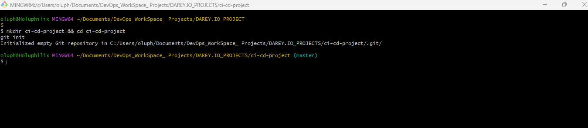
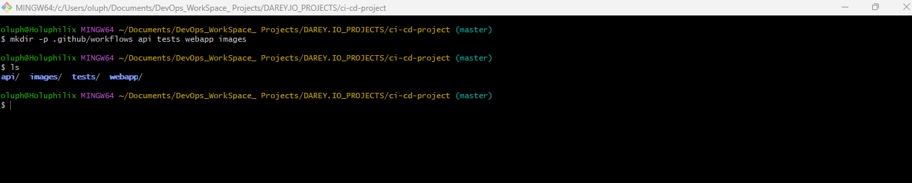
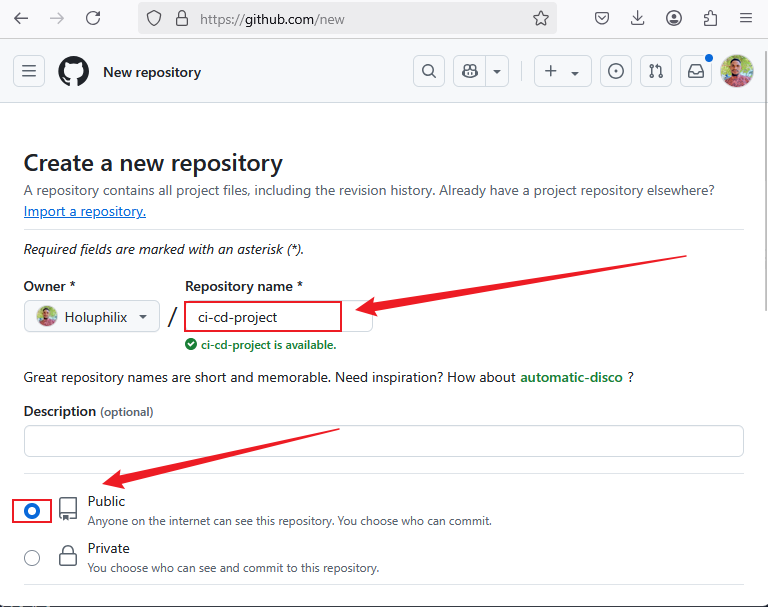

# GitHub Actions CI/CD Deployment

## Introduction
This project demonstrates how to implement a full CI/CD pipeline using GitHub Actions. The application is built with Node.js and Docker, and it is deployed to an AWS EC2 instance.

## Prerequisites
- GitHub repository
- AWS EC2 instance
- Docker and Docker Compose
- GitHub Secrets configured for deployment
- Node.js installed locally

## Lesson 1: Project Setup & GitHub Repository

🔹 **Goal: Set up your project directory, initialize Git, and push it to GitHub.**

### Step 1: Create and Initialize the Project

- To begin, create the project directory named **ci-cd-project**, navigate into it, and initialize it as a Git repository.

**Note:** For this project, I am using **Git Bash** on a Windows workstation to execute these shell commands, as it provides a Unix-like command-line experience.

**Commands:**
```bash
mkdir ci-cd-project && cd ci-cd-project
git init
```


### Step 2: Create Project Structure

- Run the following command to set up necessary directories:

**Commands:**
```bash
mkdir -p .github/workflows api tests webapp images
```


**Project Structure:**

**Commands:**
```bash
ci-cd-project/
│── .github/
│   ├── workflows/   # GitHub Actions workflows
│── api/             # Backend API
│── webapp/          # Frontend (optional)
│── images/          # Screenshots for documentation
│── tests/           # Test files
│── README.md        # Project documentation
│── docker-compose.yml  # Docker setup
│── .gitignore       # Ignore unnecessary files
```

### Step 3: Initialize Git & Create a GitHub Repository
1️⃣ Create a GitHub repository:

- Go to GitHub → New Repository
- Name it ci-cd-project
- Select Public or Private
- Do NOT initialize with a README (we will add ours)
- Click Create Repository



2️⃣ Link local project to GitHub:

**Commands:**
```bash
git remote add origin https://github.com/Holuphilix/ci-cd-project.git
```

### Step 4: Create a README.md
- Inside your project folder, run:

**Commands:**
```bash
touch README.md
```

### Step 5: Add & Push to GitHub
- Run these commands to push the code:

**Commands:**
```bash
git add .
git commit -m "Initial project setup"
git branch -M main
git push -u origin main
```
